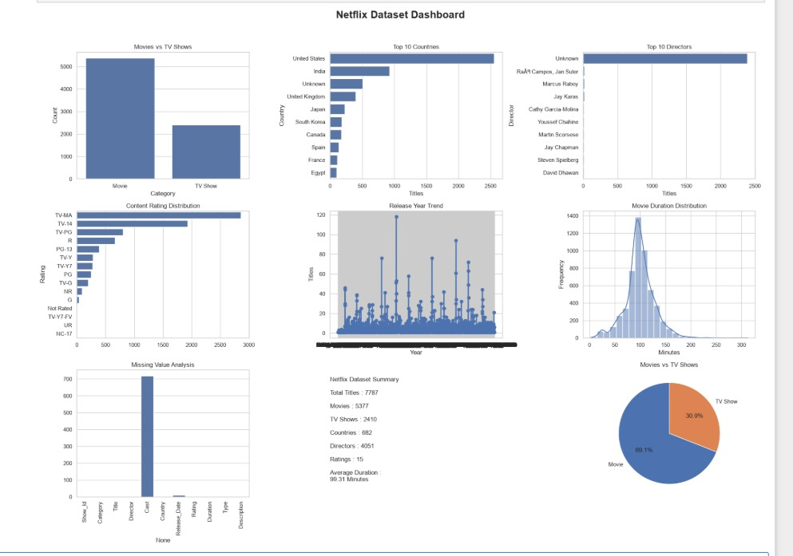

# 🎬 Netflix Data Analysis Dashboard

A comprehensive **Netflix Data Analysis Project** built using **Python, Pandas, NumPy, Matplotlib, and Seaborn**. This project performs data cleaning, exploratory data analysis (EDA), KPI generation, and interactive visualizations to uncover insights from the Netflix dataset.

---

## 📌 Project Overview

This project analyzes Netflix movies and TV shows to answer **30 business problem statements** and generate meaningful KPIs with visual dashboards.

The analysis includes:

- Data Cleaning
- Missing Value Handling
- Exploratory Data Analysis (EDA)
- KPI Analysis
- Business Insights
- Dashboard Visualization

---

## 🎯 Objectives

- Analyze Netflix Movies and TV Shows.
- Identify top content-producing countries.
- Find leading directors and actors.
- Study release trends over the years.
- Analyze ratings and movie duration.
- Generate business insights using visualization.
- Build a dashboard for quick decision making.

---

# 🛠 Technologies Used

- Python 3.x
- Pandas
- NumPy
- Matplotlib
- Seaborn
- Jupyter Notebook

---

# 📂 Dataset

Dataset: **Netflix Dataset.csv**

Main columns used:

- Title
- Category
- Director
- Cast
- Country
- Rating
- Duration
- Release_Date
- Description

---

# 📦 Python Libraries

```python
import pandas as pd
import numpy as np
import matplotlib.pyplot as plt
import seaborn as sns
```

---

# 📊 Key Performance Indicators (KPIs)

The project solves the following KPIs:

### KPI 1
Total Movies

### KPI 2
Total TV Shows

### KPI 3
Movies vs TV Shows Percentage

### KPI 4
Top 10 Countries Producing Netflix Content

### KPI 5
Top Directors

### KPI 6
Most Common Content Rating

### KPI 7
Release Year Trend

### KPI 8
Peak Release Year

### KPI 9
Longest Movie

### KPI 10
Average Movie Duration

### KPI 11
Most Frequently Appearing Actor

### KPI 12
Rating Distribution by Category

### KPI 13
Countries Producing Movies and TV Shows

### KPI 14
Monthly Release Trend

### KPI 15
Missing Value Analysis

### KPI 16
Top 15 Directors

### KPI 17
Country-wise Rating Analysis

### KPI 18
Movie vs TV Show Growth Trend

### KPI 19
Shortest Movie

### KPI 20
Rating Diversity

### KPI 21
Title Length Analysis

### KPI 22
Most Common Words in Titles

### KPI 23
Description Length Analysis

### KPI 24
Duplicate Titles

### KPI 25
Directors Who Directed Both Movies and TV Shows

### KPI 26
Family Friendly Content Trend

### KPI 27
Mature Content by Country

### KPI 28
Netflix Dashboard

### KPI 29
Exploratory Data Analysis (EDA)

### KPI 30
Business Recommendations

---

# 📈 Visualizations

The project includes the following charts:

- Bar Chart
- Horizontal Bar Chart
- Pie Chart
- Histogram
- Line Chart
- Box Plot
- Heatmap
- Dashboard
- KPI Summary

---

# 📊 Dashboard Includes
# 📊 Dashboard Preview

The project dashboard provides a quick overview of Netflix content, including KPIs and visualizations.

<p align="center">
  
</p>

The dashboard includes:

- 📌 Total Titles
- 🎬 Movies vs TV Shows
- 🌍 Top 10 Countries
- 🎥 Top Directors
- ⭐ Content Rating Distribution
- ⏳ Movie Duration Distribution
- 📈 Release Year Trend
- 📊 Missing Value Analysis

Charts:

- Movies vs TV Shows
- Top Countries
- Top Directors
- Rating Distribution
- Release Year Trend
- Movie Duration Distribution
- Missing Value Analysis
- Netflix Summary

---

# 🧹 Data Cleaning

The dataset is cleaned by:

- Removing duplicate records
- Filling missing Director values
- Filling missing Country values
- Filling missing Rating values
- Extracting movie duration into numeric format

---

# 📁 Project Structure

```
Netflix-Data-Analysis/
│
├── Netflix Dataset.csv
├── Netflix_Analysis.ipynb
├── README.md
├── requirements.txt
└── images/
```

---

# ▶️ How to Run

### Clone Repository

```bash
git clone https://github.com/yourusername/netflix-data-analysis.git
```

### Install Dependencies

```bash
pip install pandas numpy matplotlib seaborn
```

### Open Jupyter Notebook

```bash
jupyter notebook
```

### Run

Open

```
Netflix_Analysis.ipynb
```

Run all cells.

---

# 📌 Business Insights

- Movies dominate the Netflix catalog.
- A few countries contribute the majority of Netflix content.
- Some directors have significantly higher content production.
- Family-friendly content has increased over recent years.
- Mature-rated content is concentrated in selected countries.
- Movie duration is generally between 80–120 minutes.
- Netflix maintains a diverse content rating portfolio.

---

# 📚 Learning Outcomes

Through this project, you will learn:

- Data Cleaning with Pandas
- Exploratory Data Analysis
- Data Visualization
- KPI Generation
- Dashboard Creation
- Business Insight Extraction

---

# 🚀 Future Improvements

- Interactive Dashboard using Plotly
- Streamlit Web Application
- Power BI Dashboard
- Tableau Dashboard
- Recommendation System
- Machine Learning Prediction

---

# 👨‍💻 Author

**Aman Das**

Python | Data Analytics | Machine Learning Enthusiast

---

# ⭐ If you found this project useful, don't forget to Star the repository!
